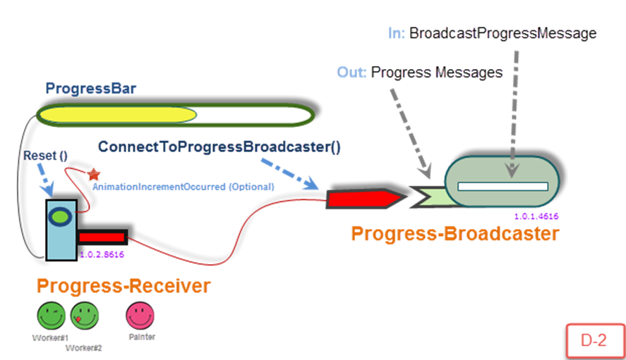

To use the **Progress-Broadcaster** components, simply follow the instructions below;

[How-To Setup the Progress-Receiver WPF user-control?](How-To-Setup-the-Progress-Receiver-WPF-user-control_)
[ How-To Setup the Progress-Broadcaster Component?](-How-To-Setup-the-Progress-Broadcaster-Component_)

Thanks,
Ben Scharbach