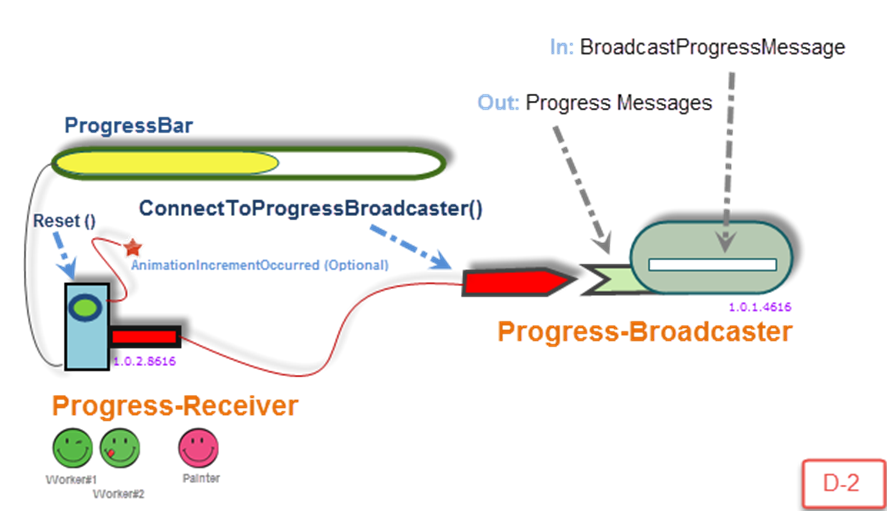

**Progress Broadcasting Library and Animated Progress-Bar Control**
[http://temporalwars.com/CodeHelpers/ProgressBroadcaster](http://temporalwars.com/CodeHelpers/ProgressBroadcaster)

To communicate progress-iteration simply and quickly using a two-part component design.

The first component called the +progress-broadcaster+ is used to communicate progress iteration information during some common collection iteration operation.   The information communicated via events is comprised of three pieces of information; count, total and header.   

The second component will be a WPF user-control assembly.  This WPF user-control is separate from the broadcasting assembly.  This separation allows using the broadcasting assembly in other projects, while the WPF user-control can relay this information, in real-time, on some WPF application's window. 

The two components are then connected to allow progress information to flow from the +progress-broadcaster+ directly to the WPF progress-bar user-control.

Within the WPF user-control, a progress-animation algorithm is included.  The progress-animation algorithm uses an averaging timer to track the rate of updates sent from the broadcasting component.  This information is used to update the progress-bar's animation over time, which is reflected in the rate of movement for the progress-bar's animation.

For my first check-in, only the broadcasting component assembly code is available, which I extracted from my internal 'Common' library.   My future check-ins will contain code for the progress-animation class and WPF user-control.

Ben Scharbach
 

